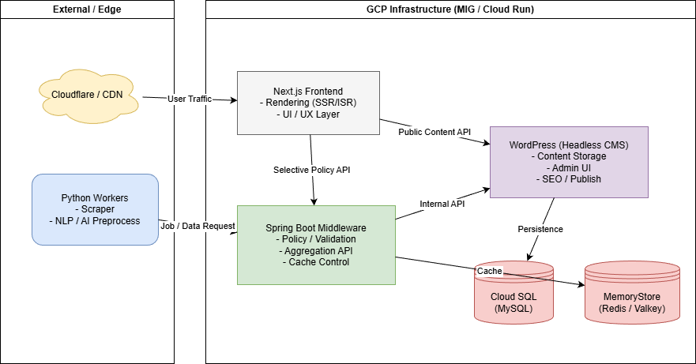

## Project Overview
[kr REAME](README.md)
This repository documents the **server architecture and design philosophy** of the Kpopmap project.

Kpopmap is not a simple news aggregation site.  
It is a platform that provides **original, value-added content derived from legally collected source data**.

The purpose of this architecture is not to replace WordPress,  
but to support Kpopmap’s proprietary content pipeline through clear responsibility separation.

---

## 🇺🇸 Content Collection & Copyright Policy

All content handled by Kpopmap follows these principles:

- ❌ No illegal crawling
- ❌ No unauthorized copying
- ❌ No unlicensed RSS scraping

Content published on Kpopmap is **not a raw reproduction of source material**,  
but a transformed and processed result created under Kpopmap’s own editorial and technical standards.

---

## 🇺🇸 Background

Kpopmap is a content-heavy platform with:

- News collection via APIs and structured web sources
- Quality filtering and similarity control
- AI-based analysis and content restructuring
- Read-heavy traffic patterns
- WordPress-based CMS
- Gradual migration toward a Next.js frontend

As the platform evolved, a monolithic WordPress architecture became insufficient to manage these responsibilities cleanly.

---

## 🇺🇸 Design Principles

### 1. WordPress Remains the CMS
WordPress is responsible for:

- Content storage (source of truth)
- Admin and publishing workflows
- SEO and editorial control

It is **not treated as a general-purpose processing backend**.

---

### 2. Next.js Handles User Experience
Next.js is responsible for:

- SSR / ISR rendering
- UI / UX
- Public request handling

It may access WordPress directly for read-only content.

---

### 3. Spring Boot Is a Policy-Oriented Middleware
Spring Boot is intentionally **not placed at the center of all traffic**.

Its responsibilities include:

- Policy and validation logic
- Internal API aggregation
- Cache control
- Orchestration between Python workers and WordPress

The system must remain operational even if Spring Boot is unavailable.

---

### 4. Python Handles Data Collection and Processing
Python services handle:

- News collection via official APIs and permitted web sources
- Article normalization and quality filtering
- Similarity and deduplication analysis
- NLP / AI preprocessing

Python services never write directly to WordPress.

---

## 🇺🇸 Architecture Diagram

